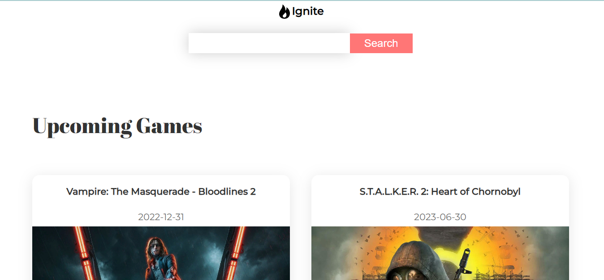

# Getting Started with Create React App

This project was bootstrapped with [Create React App](https://github.com/facebook/create-react-app).

## Table of contents

- [Overview](#overview)
  - [Screenshot](#screenshot)
  - [Links](#links)
  - [Built with](#built-with)
  - [What I learned](#what-i-learned)
  - [Useful resources](#useful-resources)
- [Author](#author)

## Overview
This is a game information website.
### Screenshot

### Links

- Solution URL: [https://github.com/PrincessMaggy/ignite.git]
- Live Site URL: [https://princessmaggy.github.io/ignite]

### Built with
- React
- Styled Components
- Framer Motion
- Axios
- React Redux

- installed dependencies
npm: npm install redux react-redux react-router-dom styled-components framer-motion redux-thunk axios

### What I learned
- I got better understanding of how react redux works.

- I also learnt how to pull out data from a local api using axios.

### Useful resources
- [api website](https://rawg.io/@edozie/apikey)

- To learn about regex expressions - https://regex101.com/
## Author

- Website - [Maggy](https://princessmaggy.github.io/My-Portfolio/)
- Frontend Mentor - [@Maggy](https://www.frontendmentor.io/profile/princessmaggy)
- Twitter - [@princessMaggy7](https://www.twitter.com/princessMaggy7)

- Things to do: 
1. Make website responsive
2. Fix bug on toggling
3. Fix error on searched games action

